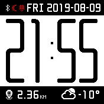
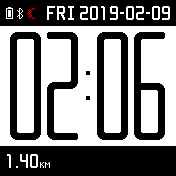
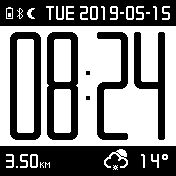
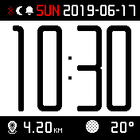
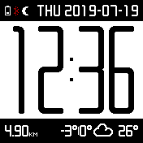
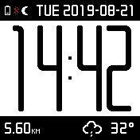
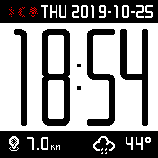

Custom watchface for [Amazfit Bip](https://en.amazfit.com/bip.html) smartwatches.

# Shots

 
 

# Installation

## Android

* You need [Mi Fit](https://play.google.com/store/apps/details?id=com.xiaomi.hm.health) app installed.
* Download [archive](https://bitbucket.org/gelin/bip-watchface/downloads/gelin-2019.zip).
* Unpack the archive and put two files from it (`.bin` and `.png`) to your phone.
* Using a file manager create a new folder (with any name) under `Android/data/com.xiaomi.hm.health/files/watch_skin_local/` on a volume where Mi Fit is installed.
* Copy the files from archive to the new folder.
* Open Mi Fit, navigate to Profile→Devices→Amazfit Bip→Theme settings→Local watchfaces
* Find out the image of the new watchface, click and install it.

# Build

## With Ubuntu

* You need [AmazfitBipTools](https://bitbucket.org/valeronm/amazfitbiptools/) and Wine.
* [Download](https://bitbucket.org/valeronm/amazfitbiptools/downloads/) AmazfilBitTools archive and unpack it to `~/opt/AmazfitBipTools`.
* Install Wine.
* [Install](https://askubuntu.com/a/992215/123682) Mono for Wine.
* Run `make`. Instruct `Makefile` for more details.

See also the [online watchface editor](https://v1ack.github.io/watchfaceEditor/).
